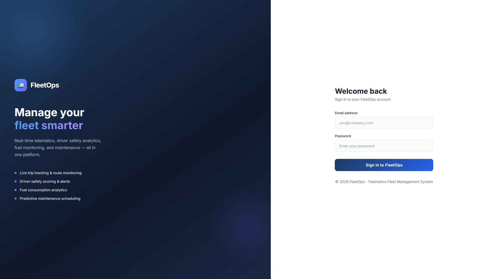
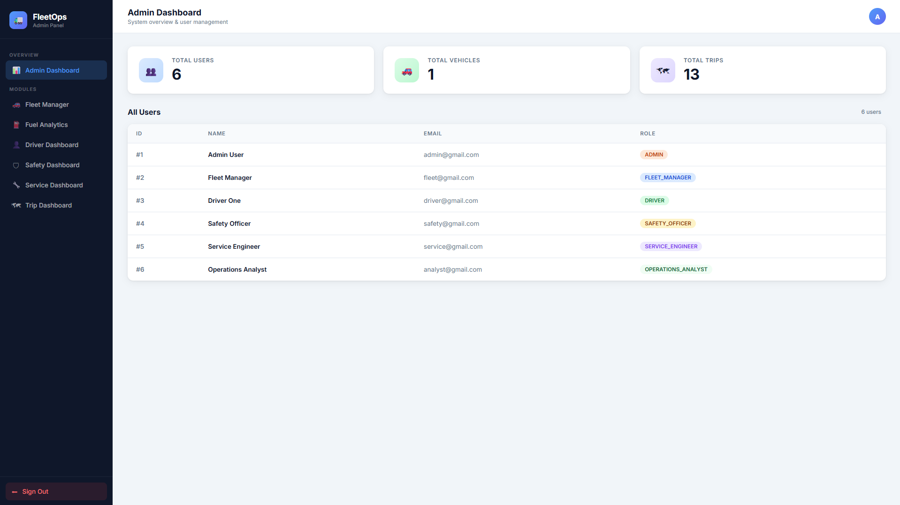
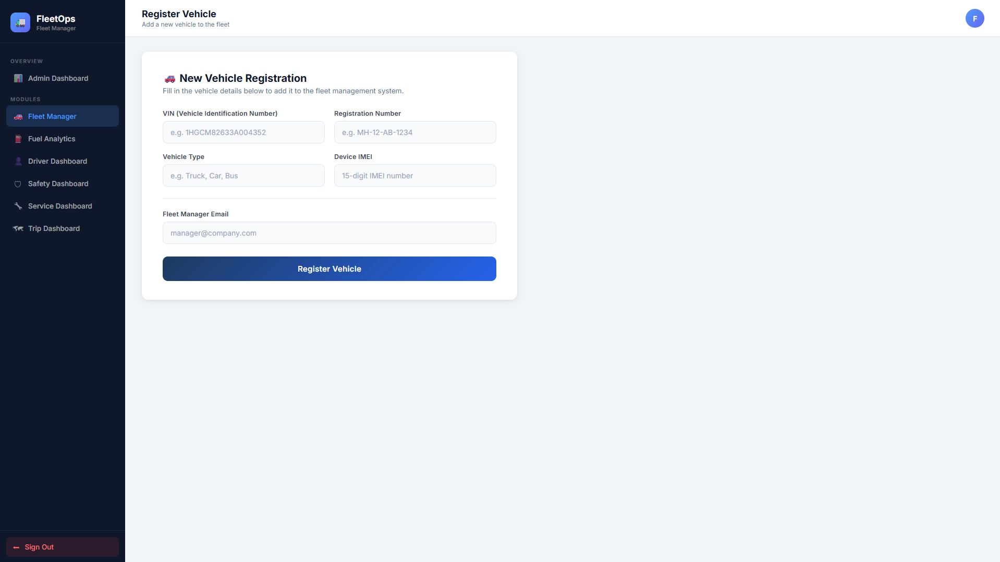
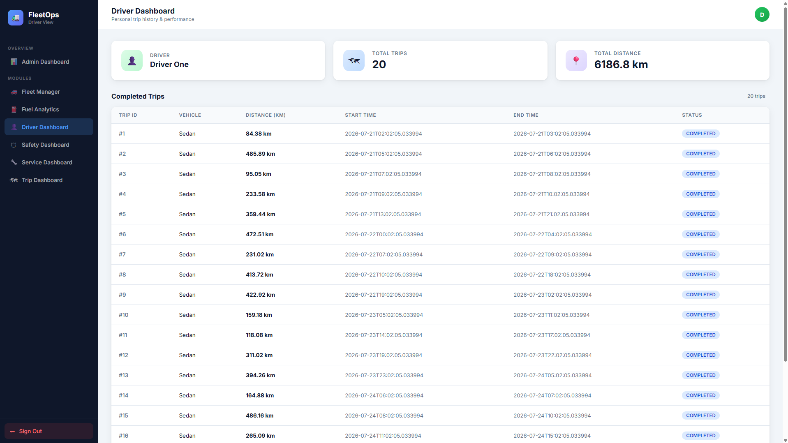
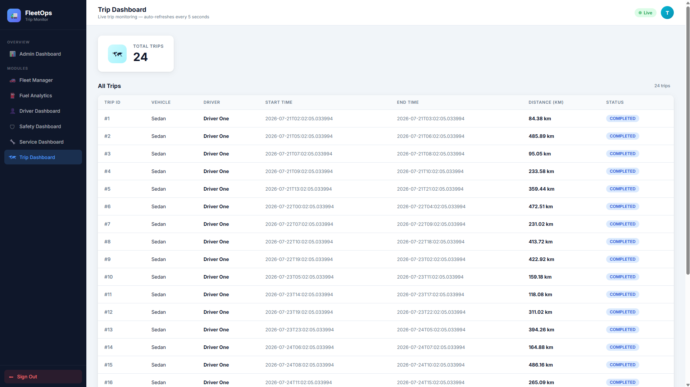
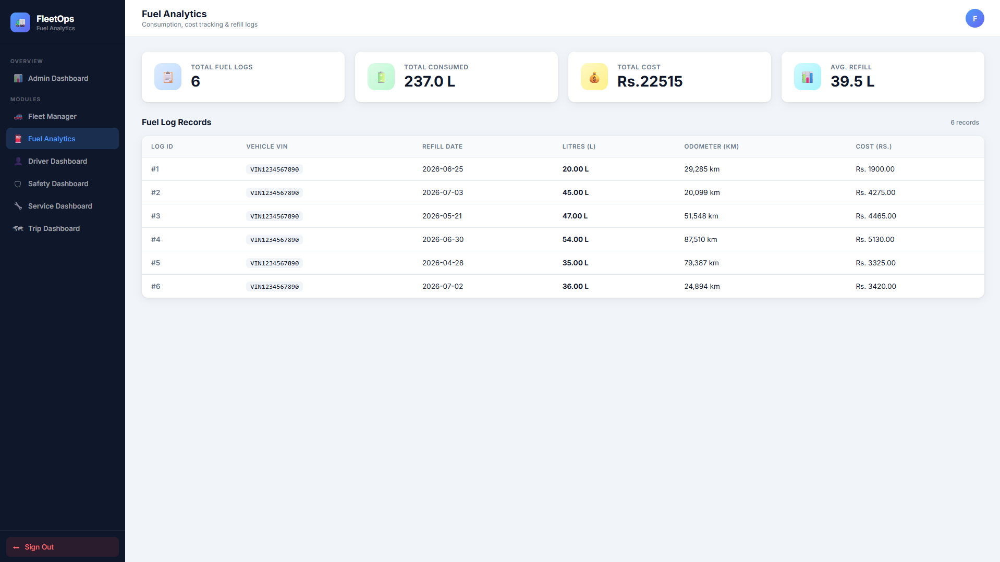
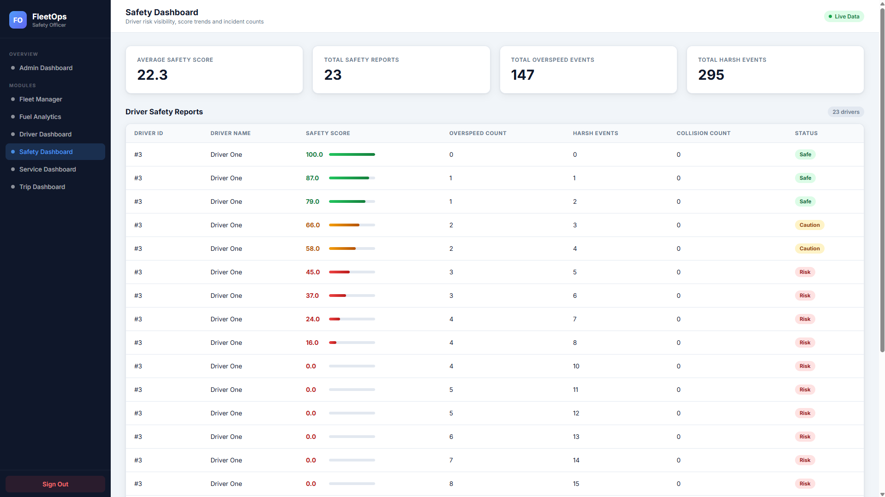
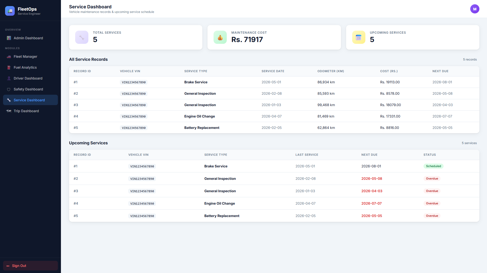

<div align="center">



# Connected Vehicle Telematics Fleet Management System

### Enterprise Fleet Monitoring & Telematics Solution

*A Spring Boot application for real-time vehicle tracking, trip management, fuel monitoring, maintenance scheduling, and driver safety analytics.*


</div>

## Table of Contents

- [Overview](#overview)
- [Features](#features)
- [Screenshots](#screenshots)
- [System Architecture](#system-architecture)
- [Technology Stack](#technology-stack)
- [Prerequisites](#prerequisites)
- [Installation & Setup](#installation--setup)
- [Configuration](#configuration)
- [Database Schema](#database-schema)
- [API Documentation](#api-documentation)
- [User Roles & Permissions](#user-roles--permissions)
- [Project Structure](#project-structure)
- [Running the Application](#running-the-application)
- [Key Components](#key-components)
- [Development Guide](#development-guide)
- [Troubleshooting](#troubleshooting)
- [Support](#support)

## Overview

The Connected Vehicle Telematics Fleet Management System is an enterprise-grade solution for fleet operators to:

- **Monitor Vehicles** in real-time with GPS tracking and telemetry data
- **Manage Trips** with start/end locations, duration, and driver information
- **Track Fuel** consumption and cost analysis
- **Schedule Maintenance** with service records and vehicle status tracking
- **Analyze Driver Behavior** with safety scores and performance metrics
- **Generate Reports** for operational analytics and compliance

## Features

### Core Features

1. **Vehicle Management**
   - Register and track vehicles with VIN and registration numbers
   - Monitor vehicle status (active, inactive, maintenance)
   - Device IMEI tracking for telematics hardware
   - Real-time location and telemetry data

2. **Trip Management**
   - Record vehicle trips with start/end timestamps
   - Track distance, duration, and driver information
   - Trip status monitoring (ongoing, completed, cancelled)
   - Analytics on trip patterns and efficiency

3. **Fuel Management**
   - Log fuel consumption and refueling events
   - Calculate fuel efficiency metrics
   - Cost analysis and anomaly detection
   - Per-vehicle and fleet-wide fuel reports

4. **Maintenance & Service**
   - Schedule and track maintenance activities
   - Service record history and documentation
   - Preventive maintenance planning
   - Vehicle downtime tracking

5. **Safety & Driver Analytics**
   - Driver behavior scoring and analysis
   - Safety incident tracking
   - Real-time telemetry metrics (speed, acceleration, braking)
   - Driver performance reports

6. **User & Access Management**
   - Role-based access control (RBAC)
   - Multiple user roles with specific permissions
   - Secure authentication and authorization
   - User activity auditing

### Secondary Features

- Real-time dashboard with key metrics
- Historical data analysis and trend reporting
- Dummy data generation for testing and demos
- Responsive web UI with Thymeleaf templates
- RESTful API endpoints for third-party integration

## Screenshots

| Login | Admin Dashboard |
|-------|-----------------|
|  |  |

| Fleet Manager | Driver Dashboard |
|----------------|------------------|
|  |  |

| Trip Dashboard | Fuel Dashboard |
|----------------|----------------|
|  |  |

| Safety Dashboard | Service Dashboard |
|------------------|-------------------|
|  |  |

## System Architecture

```
┌─────────────────────────────────────────────────────────┐
│                   Web UI (Thymeleaf)                     │
│  ┌──────────┬─────────┬────────┬──────────┬──────────┐  │
│  │ Admin    │ Fleet   │ Driver │ Service  │ Safety   │  │
│  │Dashboard │Manager  │Portal  │Engineer  │Officer   │  │
│  └──────────┴─────────┴────────┴──────────┴──────────┘  │
└─────────────────────────────────────────────────────────┘
                         ↓
┌─────────────────────────────────────────────────────────┐
│         REST API Layer (Spring MVC Controllers)          │
│  ┌──────────┬────────┬──────────┬──────────┬──────────┐ │
│  │ Admin    │ Fleet  │ Vehicle  │ Trip     │ Safety   │ │
│  │ API      │ API    │ API      │ API      │ API      │ │
│  └──────────┴────────┴──────────┴──────────┴──────────┘ │
└─────────────────────────────────────────────────────────┘
                         ↓
┌─────────────────────────────────────────────────────────┐
│        Service Layer (Business Logic)                    │
│  ├─ VehicleService      ├─ TripService                  │
│  ├─ FuelService         ├─ TelemetryService             │
│  ├─ DriverService       ├─ SafetyService                │
│  ├─ AdminService        └─ VehicleServiceService        │
└─────────────────────────────────────────────────────────┘
                         ↓
┌─────────────────────────────────────────────────────────┐
│     Repository Layer (Data Access - JPA)                │
│  ├─ VehicleRepository   ├─ TripRepository               │
│  ├─ UserRepository      ├─ TelemetryRepository          │
│  ├─ FuelLogRepository   └─ DriverScoreRepository        │
└─────────────────────────────────────────────────────────┘
                         ↓
┌─────────────────────────────────────────────────────────┐
│              MySQL Database                              │
│  ├─ fleetmanagement (primary database)                  │
│  └─ Tables: User, Vehicle, Trip, Telemetry, FuelLog... │
└─────────────────────────────────────────────────────────┘
```

## Technology Stack

| Component | Technology | Version |
|-----------|-----------|---------|
| **Framework** | Spring Boot | 4.0.6 |
| **Java** | JDK | 21 |
| **Database** | MySQL | 8.0+ |
| **ORM** | Hibernate (JPA) | 6.2+ |
| **Web Template** | Thymeleaf | 3.1+ |
| **Security** | Spring Security | 6.1+ |
| **Build Tool** | Maven | 3.8+ |
| **Utilities** | Lombok | 1.18+ |

## Prerequisites

### System Requirements
- **Java Development Kit (JDK)** 21 or higher
- **Maven** 3.8.0 or higher
- **MySQL Server** 8.0 or higher
- **Git** (for cloning the repository)

### IDE (Recommended)
- IntelliJ IDEA (Community or Ultimate)
- Eclipse IDE with Spring Tools
- VS Code with Java Extensions

## Installation & Setup

### Step 1: Clone the Repository

```bash
git clone https://github.com/ARCHITRAGHAV/Connected-Vehicle-Telematics-Fleet-Management-System.git

cd Connected-Vehicle-Telematics-Fleet-Management-System
```

### Step 2: Configure MySQL Database

1. **Start MySQL Service** (Windows)
```bash
net start MySQL80
```

2. **Create Database Connection** (Optional - auto-created by Spring)
```sql
CREATE DATABASE fleetmanagement;
```

### Step 3: Update Database Credentials

Edit `src/main/resources/application.properties`:

```properties
spring.datasource.url=jdbc:mysql://localhost:3306/fleetmanagement?createDatabaseIfNotExist=true&useSSL=false&allowPublicKeyRetrieval=true&serverTimezone=UTC
spring.datasource.username=root
spring.datasource.password=root
```

### Step 4: Build the Project

```bash
mvn clean install
```

### Step 5: Run the Application

**Option A: Using Maven**
```bash
mvn spring-boot:run
```

**Option B: Running the JAR file**
```bash
mvn clean package
java -jar target/telematics-fleet-management-0.0.1-SNAPSHOT.jar
```

### Step 6: Access the Application

- **Web UI**: http://localhost:8082

## Configuration

### Application Properties

**File**: `src/main/resources/application.properties`

```properties
# Application Configuration
spring.application.name=telematics-fleet-management
server.port=8082

# MySQL Database Configuration
spring.datasource.url=jdbc:mysql://localhost:3306/fleetmanagement
spring.datasource.username=root
spring.datasource.password=root
spring.datasource.driver-class-name=com.mysql.cj.jdbc.Driver

# JPA/Hibernate Configuration
spring.jpa.hibernate.ddl-auto=create-drop  # Options: create, create-drop, update, validate
spring.jpa.show-sql=true
spring.jpa.properties.hibernate.format_sql=true
spring.jpa.open-in-view=false
spring.jpa.database-platform=org.hibernate.dialect.MySQLDialect
```

**DDL Options**:
- `create-drop`: Creates tables on startup, drops on shutdown (Development)
- `create`: Creates tables on startup (Development)
- `update`: Updates schema if needed (Development/Testing)
- `validate`: Validates schema exists (Production)

### Security Configuration

**File**: `src/main/java/com/example/telematics_fleet_management/config/SecurityConfig.java`

- CSRF protection disabled for API access
- Form-based login with email as username
- Role-based access control for endpoints
- Custom success handler with role-based redirects

## Database Schema

### Core Entities

#### 1. User
```
user_id (PK)           INT AUTO_INCREMENT
username               VARCHAR(255) UNIQUE
email                  VARCHAR(255) UNIQUE
password               VARCHAR(255) ENCRYPTED
role                   ENUM(ADMIN, FLEET_MANAGER, DRIVER, SERVICE_ENGINEER, SAFETY_OFFICER, OPERATIONS_ANALYST)
```

#### 2. Vehicle
```
vehicle_id (PK)        INT AUTO_INCREMENT
vin                    VARCHAR(50) UNIQUE
registration_number    INT
vehicle_type           VARCHAR(100)
device_imei            VARCHAR(50)
vehicle_status         ENUM(ACTIVE, INACTIVE, MAINTENANCE)
```

#### 3. Trip
```
trip_id (PK)           INT AUTO_INCREMENT
vehicle_id (FK)        INT
driver_id (FK)         INT
start_time             DATETIME
end_time               DATETIME
start_location         VARCHAR(255)
end_location           VARCHAR(255)
distance               DOUBLE
duration               BIGINT (milliseconds)
trip_status            ENUM(ONGOING, COMPLETED, CANCELLED)
```

#### 4. Telemetry
```
telemetry_id (PK)      INT AUTO_INCREMENT
vehicle_id (FK)        INT
trip_id (FK)           INT
timestamp              DATETIME
latitude               DOUBLE
longitude              DOUBLE
speed                  DOUBLE
acceleration          DOUBLE
braking_force         DOUBLE
engine_temperature     DOUBLE
```

#### 5. FuelLog
```
fuel_id (PK)           INT AUTO_INCREMENT
vehicle_id (FK)        INT
trip_id (FK)           INT
refuel_date            DATE
quantity_liters        DOUBLE
cost                   DOUBLE
mileage                INT
efficiency            DOUBLE (km/l)
```

#### 6. ServiceRecord
```
service_id (PK)        INT AUTO_INCREMENT
vehicle_id (FK)        INT
service_date           DATE
service_type           VARCHAR(100)
description            TEXT
cost                   DOUBLE
next_service_date      DATE
```

#### 7. DriverScore
```
score_id (PK)          INT AUTO_INCREMENT
driver_id (FK)         INT
trip_id (FK)           INT
speed_compliance       DOUBLE (0-100)
acceleration_smoothness DOUBLE (0-100)
braking_smoothness     DOUBLE (0-100)
overall_score          DOUBLE (0-100)
```

## API Documentation

### Authentication
- **Login**: POST `/login` (Form-based)
- **Logout**: Handled by Spring Security

### Admin Endpoints (`/api/admin`)
```
GET  /api/admin/dashboard         - Get admin dashboard metrics
GET  /api/admin/users             - List all users
GET  /api/admin/vehicles          - List all vehicles
GET  /api/admin/trips             - List all trips
```

### Vehicle Endpoints (`/api/vehicles`)
```
GET    /api/vehicles              - List all vehicles
GET    /api/vehicles/{id}         - Get vehicle details
POST   /api/vehicles              - Register new vehicle
PUT    /api/vehicles/{id}         - Update vehicle
DELETE /api/vehicles/{id}         - Deactivate vehicle
```

### Trip Endpoints (`/api/trips`)
```
GET    /api/trips                 - List all trips
GET    /api/trips/{id}            - Get trip details
POST   /api/trips                 - Create new trip
PUT    /api/trips/{id}            - Update trip
GET    /api/trips/vehicle/{id}    - Get trips for vehicle
```

### Fuel Endpoints (`/api/fuel-logs`)
```
GET    /api/fuel-logs             - List fuel logs
GET    /api/fuel-logs/{id}        - Get fuel log details
POST   /api/fuel-logs             - Create fuel log
PUT    /api/fuel-logs/{id}        - Update fuel log
GET    /api/fuel-logs/vehicle/{id} - Get fuel logs for vehicle
```

### Safety Endpoints (`/api/safety`)
```
GET    /api/safety/dashboard      - Safety metrics
GET    /api/safety/driver-scores  - Driver performance scores
GET    /api/safety/incidents      - Safety incidents
```

## User Roles & Permissions

### Role-Based Access Control Matrix

| Role | Admin | Fleet Manager | Driver | Service Eng | Safety Officer | Ops Analyst |
|------|-------|---------------|--------|------------|-----------------|------------|
| View Dashboard | ✓ | ✓ | ✓ | ✓ | ✓ | ✓ |
| Manage Users | ✓ | ✗ | ✗ | ✗ | ✗ | ✗ |
| Manage Vehicles | ✓ | ✓ | ✗ | ✗ | ✗ | ✗ |
| View Trips | ✓ | ✓ | ✓ | ✗ | ✓ | ✗ |
| View Fuel Logs | ✓ | ✓ | ✗ | ✗ | ✗ | ✓ |
| Schedule Service | ✓ | ✓ | ✗ | ✓ | ✗ | ✗ |
| View Safety Metrics | ✓ | ✓ | ✓ | ✗ | ✓ | ✗ |
| Generate Reports | ✓ | ✓ | ✗ | ✗ | ✗ | ✓ |

### Role Descriptions

1. **Admin**: Full system access, user management, configuration
2. **Fleet Manager**: Manage fleet vehicles, trips, and maintenance
3. **Driver**: View own trip history and performance metrics
4. **Service Engineer**: Schedule and track maintenance activities
5. **Safety Officer**: Monitor safety metrics and driver behavior
6. **Operations Analyst**: Analyze fuel efficiency and operational costs

## Project Structure

```
CVTMS/
├── src/main/java/com/example/telematics_fleet_management/
│   ├── TelematicsFleetManagementApplication.java    (Main App Class)
│   ├── config/
│   │   ├── SecurityConfig.java                      (Security Configuration)
│   │   └── DataLoader.java                          (Initial Data Setup)
│   ├── model/                                       (JPA Entities)
│   │   ├── User.java
│   │   ├── Vehicle.java
│   │   ├── Trip.java
│   │   ├── Telemetry.java
│   │   ├── FuelLog.java
│   │   ├── ServiceRecord.java
│   │   ├── DriverScore.java
│   │   └── enums/
│   │       ├── Role.java
│   │       ├── VehicleStatus.java
│   │       └── TripStatus.java
│   ├── repository/                                  (Spring Data JPA)
│   │   ├── UserRepository.java
│   │   ├── VehicleRepository.java
│   │   ├── TripRepository.java
│   │   ├── TelemetryRepository.java
│   │   ├── FuelLogRepository.java
│   │   ├── ServiceRecordRepository.java
│   │   └── DriverScoreRepository.java
│   ├── service/                                     (Business Logic)
│   │   ├── AdminService.java
│   │   ├── VehicleService.java
│   │   ├── TripService.java
│   │   ├── FuelService.java
│   │   ├── DriverService.java
│   │   ├── SafetyService.java
│   │   ├── VehicleServiceService.java
│   │   └── TelemetrySimulationService.java
│   ├── controller/
│   │   ├── AdminController.java                     (REST API)
│   │   ├── VehicleController.java
│   │   ├── TripController.java
│   │   ├── FuelLogController.java
│   │   ├── DriverController.java
│   │   ├── SafetyController.java
│   │   ├── VehicleServiceController.java
│   │   ├── AuthMvcController.java
│   │   └── view/                                    (MVC Controllers)
│   │       ├── AdminViewController.java
│   │       ├── FleetManagerViewController.java
│   │       ├── DriverViewController.java
│   │       ├── ServiceViewController.java
│   │       ├── SafetyViewController.java
│   │       ├── TripViewController.java
│   │       ├── FuelLogViewController.java
│   │       └── VehicleServiceViewController.java
│   └── utils/                                       (Utilities & Generators)
│       ├── DummyUserGenerator.java
│       ├── DummyVehicleGenerator.java
│       ├── DummyTripGenerator.java
│       ├── DummyTelemetryGenerator.java
│       ├── DummyFuelLogGenerator.java
│       ├── DummyServiceRecordGenerator.java
│       └── DummyDriverScoreGenerator.java
├── src/main/resources/
│   ├── application.properties                       (Spring Configuration)
│   └── templates/                                   (Thymeleaf Views)
│       ├── login.html
│       ├── access-denied.html
│       ├── admin/
│       │   └── dashboard.html
│       ├── fleet/
│       │   └── register-vehicle.html
│       ├── driver/
│       │   └── dashboard.html
│       ├── service/
│       │   └── dashboard.html
│       ├── safety/
│       │   └── dashboard.html
│       ├── analyst/
│       │   └── dashboard.html
│       └── trip/
│           └── dashboard.html
├── pom.xml                                          (Maven Dependencies)
├── README.md                                        (This File)
└── mvnw / mvnw.cmd                                  (Maven Wrapper)
```

## Running the Application

### Development Environment

1. **Build the project**:
   ```bash
   mvn clean install
   ```

2. **Run with Maven**:
   ```bash
   mvn spring-boot:run
   ```

3. **Access the application**:
   - Web UI: http://localhost:8082
   - Login with default credentials or register a new user

### Production Environment

1. **Package the application**:
   ```bash
   mvn clean package -DskipTests
   ```

2. **Run the JAR**:
   ```bash
   java -jar target/telematics-fleet-management-0.0.1-SNAPSHOT.jar
   ```

3. **Configure for Production**:
   - Update `application.properties` with production database
   - Change DDL auto to `validate`
   - Enable SSL/HTTPS
   - Configure firewall and security

## Key Components

### Service Layer

**AdminService**
- Retrieves dashboard metrics (users, vehicles, trips)
- User management operations

**VehicleService**
- Vehicle registration and management
- Status updates and tracking
- Device IMEI management

**TripService**
- Create and manage trips
- Calculate trip metrics (distance, duration)
- Filter and search trips

**FuelService**
- Log fuel consumption
- Calculate fuel efficiency
- Generate fuel reports

**DriverService**
- Driver profile management
- Performance tracking
- Safety score calculation

**SafetyService**
- Monitor safety metrics
- Generate safety reports
- Detect anomalies

**TelemetryService**
- Real-time telemetry collection
- Simulation for demo purposes

### Utility Classes

**DummyDataGenerators**
- Generate test data for vehicles, users, trips, and telemetry
- Used for testing and demonstrations
- Can be disabled in production

## Development Guide

### Adding a New Feature

1. **Create the Entity Model** (if needed)
   - Add JPA entity in `model/`
   - Include Lombok annotations
   - Define relationships

2. **Create the Repository**
   - Extend `JpaRepository<Entity, ID>`
   - Add custom query methods if needed

3. **Implement the Service**
   - Add business logic in `service/`
   - Autowire repository
   - Handle exceptions

4. **Create the Controller**
   - Add REST endpoints in `controller/` or
   - Add MVC handler in `controller/view/`

5. **Update Security Config** (if needed)
   - Add new role permissions in `SecurityConfig.java`

6. **Create Views** (if needed)
   - Add Thymeleaf templates in `resources/templates/`

### Testing

```bash
# Run all tests
mvn test

# Run specific test class
mvn test -Dtest=VehicleServiceTest

# Run with coverage
mvn test jacoco:report
```

### Debugging

Enable Spring debugging by adding to `application.properties`:
```properties
logging.level.com.example.telematics_fleet_management=DEBUG
logging.level.org.springframework=DEBUG
logging.level.org.hibernate=DEBUG
```

## Troubleshooting

### Database Connection Issues
- Verify MySQL is running
- Check credentials in `application.properties`
- Ensure database exists or auto-create is enabled

### Port Already in Use
- Change server port in `application.properties`
- Kill existing process: `lsof -i :8082` (Linux/Mac)

### Build Failures
- Clear Maven cache: `mvn clean`
- Rebuild: `mvn install -DskipTests`
- Check Java version: `java -version` (must be 21+)

## Support

For issues, questions, or contributions, please:
1. Check existing GitHub issues
2. Create a new issue with detailed description
3. Submit pull requests with improvements